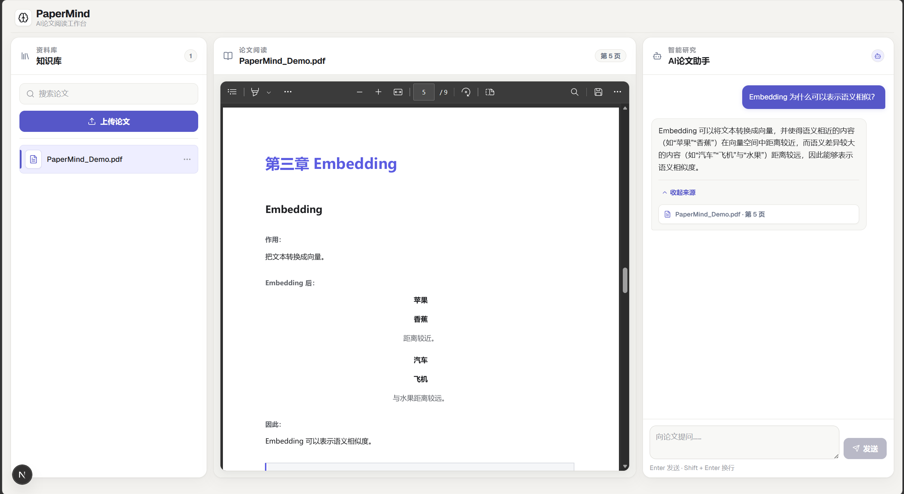
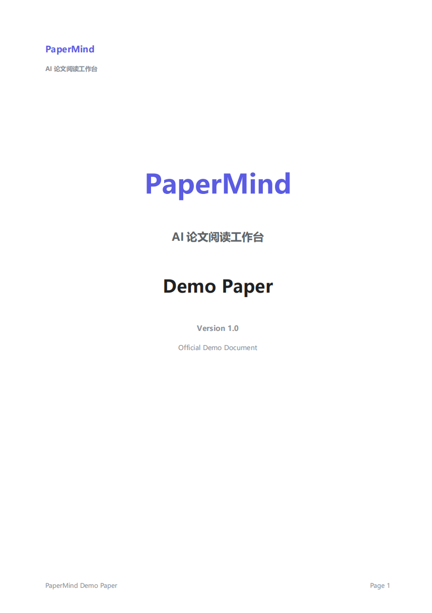

 🧠
PaperMind

AI-Powered Paper Reading Workspace

An AI paper reading workspace powered by Retrieval-Augmented Generation (RAG).

支持 PDF 阅读、知识库管理、AI 问答、Citation 来源跳转与本地知识检索。

## 📷 Product Screenshot



## 📄 Built-in Demo Paper



Python | FastAPI | React | Next.js | TypeScript | FAISS

────────────────────

让每一篇论文，
都能像与 AI 对话一样简单。

────────────────────

## ✨ Features

- 📄 PDF Reading
    支持 PDF 在线阅读与自动页码定位
- 🤖 AI Chat
    基于 RAG 的智能问答
- 📍 Citation Navigation
    点击来源自动跳转 PDF 页面
- 📚 本地知识库
- ⚡ Manifest 增量同步
- 🧠 RAG 检索增强生成
- 🔍 文档搜索
- 🗂 文件夹管理

> 🚀 Upload a PDF. Ask anything. Get cited answers instantly.

## 🚀 Installation

```bash
git clone https://github.com/yourname/PaperMind.git

cd PaperMind
```

Backend

```bash
pip install -r requirements.txt
```

Frontend

```bash
cd frontend

npm install

npm run dev
```

## 📖 Quick Start

1. 启动后端

```bash
python app.py
```

2. 启动前端

```bash
npm run dev
```

3.

打开

```
http://localhost:3000
```

上传 PDF

开始聊天。
